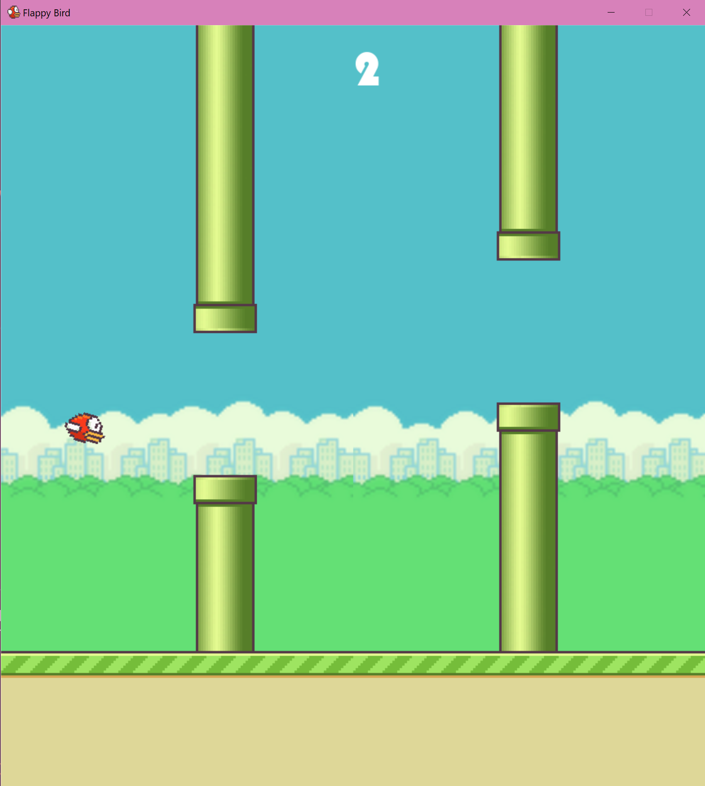

# Flappy Bird Game 🐦

This Flappy Bird game was created as a project during a programming course using Pygame. It replicates the popular Flappy Bird game where the player controls a bird to navigate through obstacles.
___

___
## Features 🔎

- Controls using the spacebar and left mouse button
- Obstacles to avoid
- Score tracking

## How to Play 🎮

1. Clone the repository or download the source code.
   ```
   https://github.com/ke1rro/flappybird.git
   ```
2. Run the `main.py` file using Python.

    ```bash
    python main.py
    ```
3. Press the spacebar or left mouse button to make the bird flap its wings and ascend.
4. Navigate the bird through the gaps between the pipes.
5. Avoid hitting the pipes or the ground.
6. The game ends when the bird collides with an obstacle.
7. Press the restart button to play again.

## Installation 💿

You can install Pygame using pip:

```bash
pip install -r requirements.txt
```
